## Identitas

- **Nama:** Raffi Darrell Firmansyah
- **NIM:** 2410511086
- **Kelas:** B

# Sistem Pengaduan Mahasiswa - Microservices Architecture

Proyek ini adalah implementasi arsitektur **Microservices** untuk Sistem Pengaduan Mahasiswa, dikembangkan sebagai pemenuhan tugas Ujian Tengah Semester (UTS) mata kuliah PPLOS.

Sistem ini memecah monolitik menjadi layanan-layanan independen yang berkomunikasi melalui API Gateway, dengan keamanan berbasis JWT dan spesifikasi database yang disesuaikan untuk masing-masing layanan (Polyglot Persistence).

---

## Arsitektur Sistem

Sistem ini terdiri dari 4 komponen utama:

1. **API Gateway (Port 3000)**
   - **Tech Stack:** Node.js, Express.
   - **Fungsi:** Bertindak sebagai pintu masuk tunggal (_Single Entry Point_). Dilengkapi dengan _Rate Limiting_ (Maksimal 60 request/menit) dan proteksi _Middleware_ JWT. Meneruskan request ke service terkait menggunakan `http-proxy-middleware`.

2. **Auth Service (Port 3001)**
   - **Tech Stack:** Node.js, Express, MongoDB.
   - **Fungsi:** Mengelola registrasi dan autentikasi pengguna. Mendukung implementasi keamanan **Lokal (JWT)** dan **Google OAuth 2.0 (Authorization Code Flow)**.

3. **Complaint Service (Port 3002)**
   - **Tech Stack:** Node.js, Express, MongoDB.
   - **Fungsi:** Layanan inti untuk membuat dan melihat daftar pengaduan mahasiswa. Menggunakan basis data NoSQL dan mengimplementasikan fitur _Pagination_ serta _Filtering_ (berdasarkan kategori pengaduan).

4. **Rating Service (Port 8082)**
   - **Tech Stack:** PHP CodeIgniter 4 (CI4), MySQL.
   - **Fungsi:** Mengelola penilaian/evaluasi terhadap layanan pengaduan. Menggunakan basis data relasional dengan **4 tabel ter-relasi** (Arsitektur _Header-Detail_). Dilengkapi fitur _Pagination_ dan penggabungan (_Join_) tabel master.

---

## Persyaratan Sistem (Prerequisites)

Sebelum menjalankan proyek ini, pastikan sistem Anda telah terinstal:

- **Node.js** (v16 atau lebih baru)
- **PHP** (v8.1 atau lebih baru) & **Composer**
- **MongoDB** (Berjalan di `mongodb://127.0.0.1:27017`)
- **MySQL / MariaDB** (melalui XAMPP/MAMP)

---

## Cara Menjalankan Aplikasi

Aplikasi ini membutuhkan keempat _service_ berjalan secara bersamaan di terminal yang berbeda.

### 1. Jalankan Auth Service

```bash
cd services/auth-service
cp .env.example .env
npm install
node server.js
```

### 2. Jalankan Complaint Service

```bash
cd services/complaint-service
cp .env.example .env
npm install
node server.js
```

### 3. Jalankan Rating Service (CodeIgniter 4)

Pastikan modul MySQL di XAMPP sudah menyala. Impor struktur database dari file .sql (jika dilampirkan) atau pastikan tabel db_rating_service sudah terkonfigurasi di phpMyAdmin.

```bash
cd services/rating-service
cp .env.example .env
composer install
php spark serve --host 127.0.0.1 --port 8082
```

### 4. jalankan API Gateway

```bash
cd gateway
cp .env.example .env
npm install
node server.js
```

### 🛠️ Pengujian API Terintegrasi (Postman)

Untuk memudahkan pengujian, saya telah menyertakan Postman Collection di dalam repository ini.

1. Buka aplikasi **Postman**.
2. Klik tombol **Import** dan pilih file `postman/collection.json`.
3. Klik tab **Variables** pada collection tersebut.
4. Ganti nilai _Current Value_ pada variabel `access_token` dengan token JWT yang Anda dapatkan setelah melakukan _Login_.

## Dokumentasi Endpoint API (Via API Gateway)

Semua _request_ dari _client_ (seperti Postman) **wajib** diarahkan ke port `3000` (API Gateway). Gateway akan secara otomatis meneruskan _request_ ke _service_ yang tepat.

### 1. Layanan Autentikasi (Public)

Endpoint ini tidak memerlukan token untuk diakses.

| Method | Endpoint                    | Keterangan                                                         |
| :----- | :-------------------------- | :----------------------------------------------------------------- |
| `POST` | `/api/auth/register`        | Mendaftarkan akun mahasiswa baru (Lokal).                          |
| `POST` | `/api/auth/login`           | Login lokal untuk mendapatkan `access_token` (JWT).                |
| `POST` | `/api/auth/refresh`         | Mengeluarkan access token baru menggunakan refresh token.          |
| `POST` | `/api/auth/logout`          | Melakukan logout dan menghapus sesi token.                         |
| `GET`  | `/api/auth/google`          | Mendapatkan URL untuk Authorization Code Flow Google OAuth 2.0.    |
| `GET`  | `/api/auth/google/callback` | Callback URL yang menerima kode dari Google dan mengembalikan JWT. |

### 2. Layanan Pengaduan (Protected)

**Wajib** menyertakan header `Authorization: Bearer <access_token>`.

| Method | Endpoint                               | Keterangan                                                                        |
| :----- | :------------------------------------- | :-------------------------------------------------------------------------------- |
| `POST` | `/api/v1/pengaduan`                    | Membuat pengaduan baru. Membutuhkan Body JSON (`judul`, `deskripsi`, `kategori`). |
| `GET`  | `/api/v1/pengaduan`                    | Mengambil daftar pengaduan.                                                       |
| `GET`  | `/api/v1/pengaduan?page=1&per_page=5`  | Contoh penerapan _Pagination_.                                                    |
| `GET`  | `/api/v1/pengaduan?kategori=fasilitas` | Contoh penerapan _Filtering_ berdasarkan kategori.                                |

### 3. Layanan Rating/Penilaian (Protected)

**Wajib** menyertakan header `Authorization: Bearer <access_token>`.

| Method   | Endpoint                           | Keterangan                                                                 |
| :------- | :--------------------------------- | :------------------------------------------------------------------------- |
| `POST`   | `/api/v1/rating`                   | Mengirim penilaian relasional (Header & Detail). Membutuhkan Body JSON.    |
| `GET`    | `/api/v1/rating`                   | Mengambil daftar riwayat penilaian dengan _Join_ tabel master.             |
| `GET`    | `/api/v1/rating?page=1&per_page=5` | Contoh penerapan _Pagination_.                                             |
| `PUT`    | `/api/v1/rating/:id`               | Mengubah data penilaian beserta detailnya (contoh ID: `/api/v1/rating/1`). |
| `DELETE` | `/api/v1/rating/:id`               | Menghapus data penilaian beserta detailnya secara permanen.                |

## Dokumentasi Pengujian API (Postman)

Berikut adalah bukti pengujian dari seluruh _endpoint_ menggunakan Postman, yang dikelompokkan berdasarkan layanannya:

### 1. Layanan Autentikasi (Auth Service)

- **Register User Lokal:**
  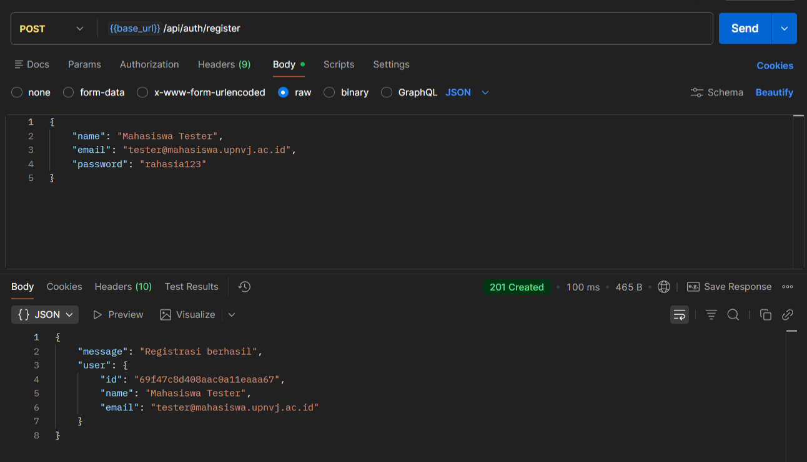
- **Login User Lokal:**
  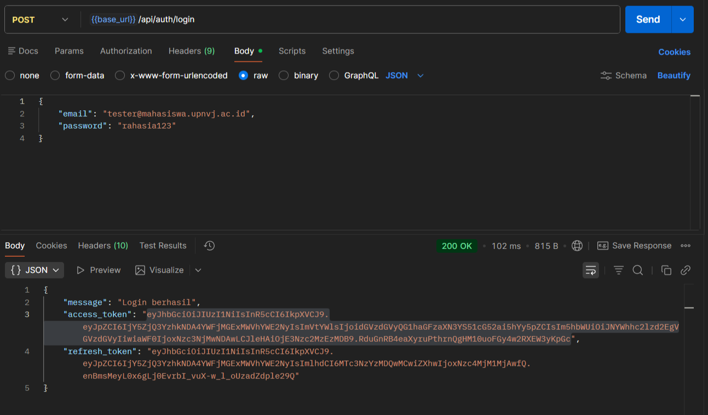
- **Login Google OAuth 2.0:**
  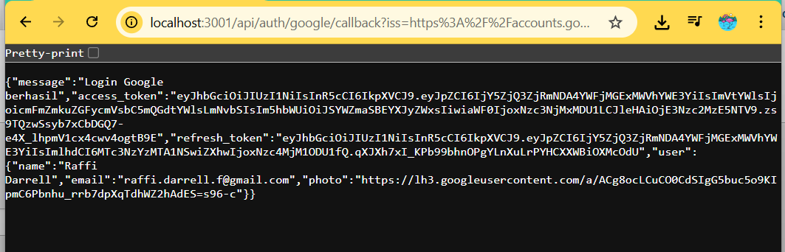
- **Refresh Token:**
  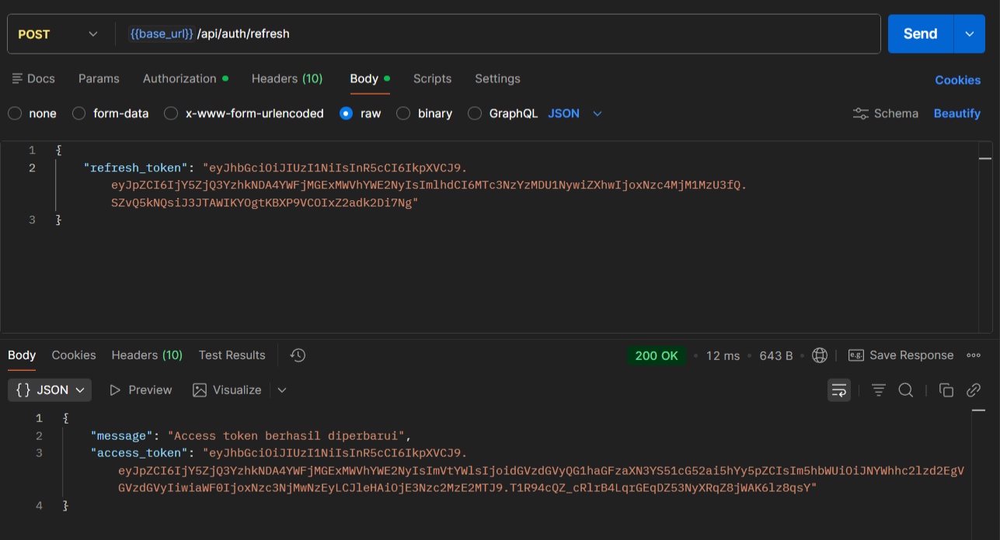
- **Logout:**
  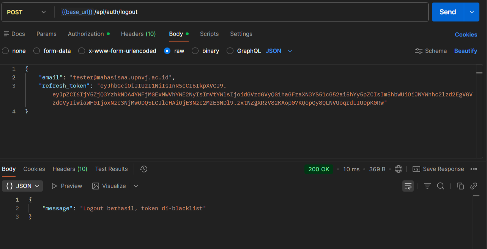

### 2. Layanan Pengaduan (Complaint Service)

- **Buat Pengaduan Baru (POST):**
  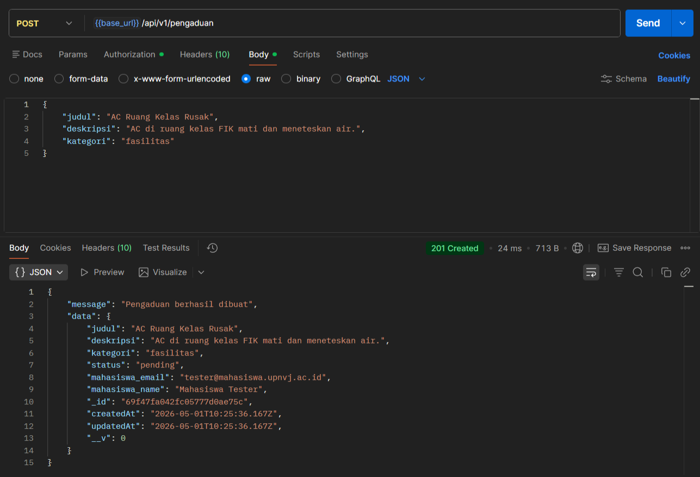
- **Ambil Daftar Pengaduan (GET):**
  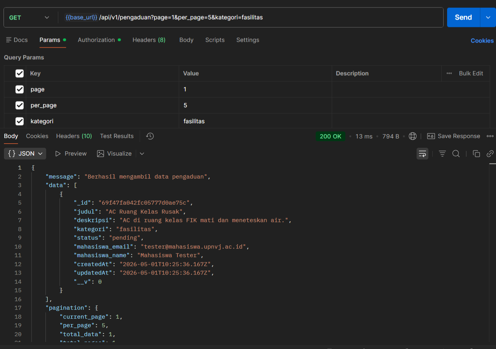

### 3. Layanan Penilaian (Rating Service)

- **Beri Penilaian (POST):**
  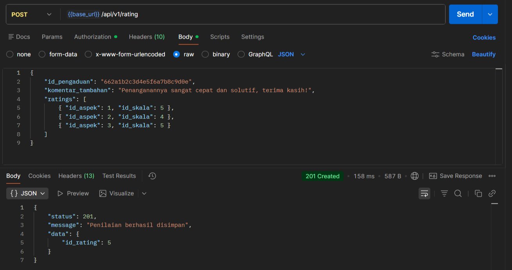
- **Ambil Riwayat Penilaian (GET):**
  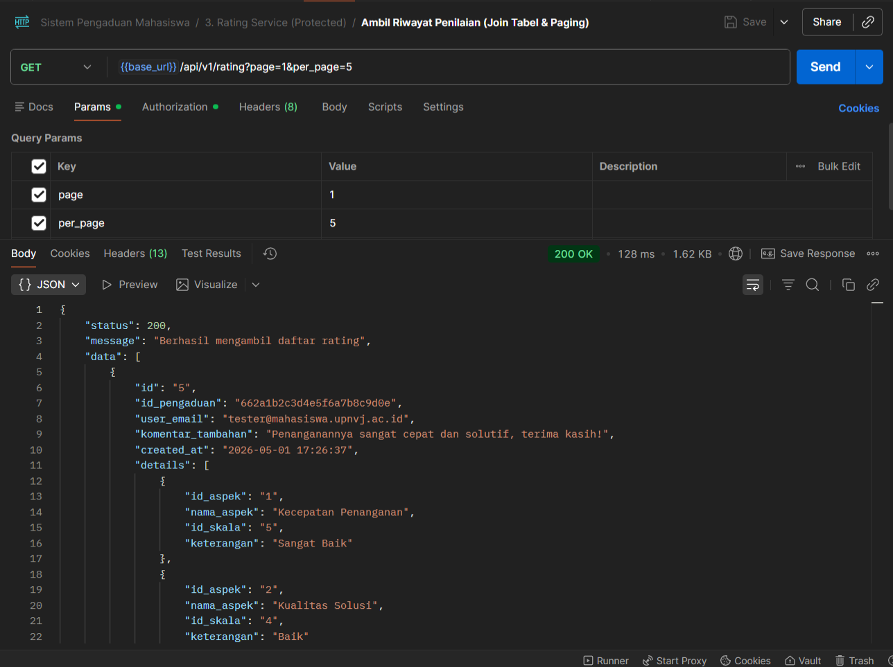
- **Ubah Penilaian (PUT):**
  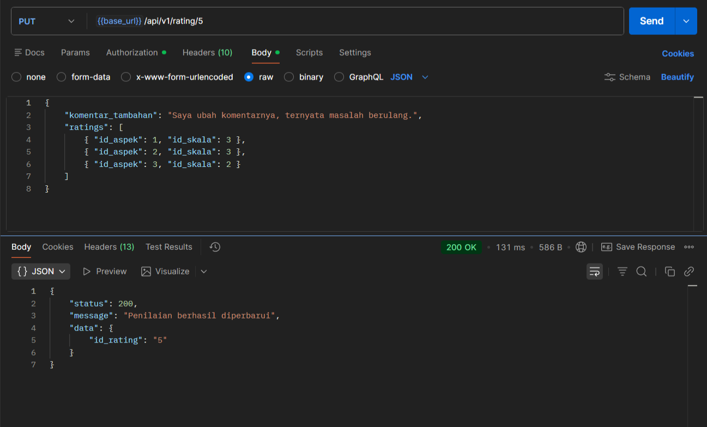
- **Hapus Penilaian (DELETE):**
  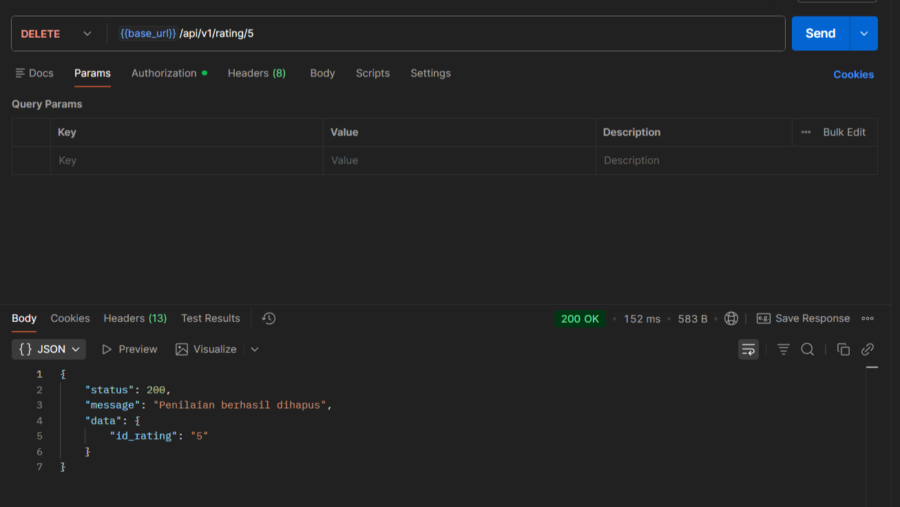
